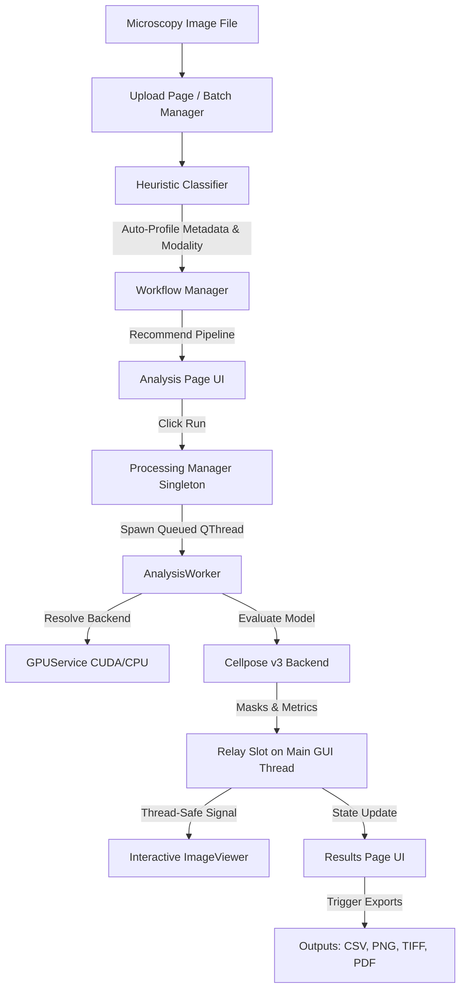

# Lumen

A modern, AI-powered desktop microscopy analysis platform focused on automated cell segmentation, workflow intelligence, and high-throughput scientific data extraction.

---

## The Vision: Why Lumen Matters

Modern biological research generates massive amounts of microscopy imaging data daily, but extracting meaningful quantitative metrics remains a major bottleneck. Researchers are typically forced to choose between:
- **Generic open-source tools (Fiji/ImageJ)**, which require tedious manual configuration, manual thresholding, and have steep learning curves.
- **Fragile classical watershed algorithms**, which suffer from "marker explosion" or "marker starvation" and fail to generalize across noisy fluorescence imaging modalities.
- **Enterprise AI suites**, which are expensive, lock data into proprietary clouds, and require complex coding.

**Lumen solves this bottleneck.** It provides a local, production-grade, zero-configuration desktop workstation that automatically profiles microscopy images, routes them to state-of-the-art deep learning architectures (e.g. Cellpose), and extracts standardized, publishable scientific measurements. By combining advanced deep learning models with a responsive, high-performance desktop interface, Lumen enables researchers to run batch analysis of hundreds of multi-gigabyte microscopy images with single-click ease.

---

## Current Stable Features

### 📡 Image Handling & Profiling Intelligence
- **Intelligent Modality Detection**: Automatically inspects file metadata and pixel arrays on import. It classifies the image type (e.g., *Fluorescence Microscopy*, *Brightfield Microscopy*, *Colony Plates*) using heuristic structural and keyword metrics.
- **16-bit to 8-bit Display Normalization**: Desktop displays can only render 8-bit grayscale channels. Lumen automatically scales 16-bit high-dynamic-range TIFF microscopy images down to 8-bit display buffers using a robust **1st/99th percentile contrast-stretching** algorithm. Flat or low-signal images are protected by a division-by-zero safeguard.
- **Metadata Extraction**: Instantly extracts and displays pixel resolution, channel dimensions, data type, bit depth, and classification properties.

### 🔬 Interactive Viewer System
- **Scientific Image Viewer**: Features a high-performance, zoomable, and pannable graphics canvas custom-tailored for large biological image inspection.
- **Mask Overlays**: Generates high-contrast, random-seeded pseudocolor segmentation masks rendered directly on top of the original grayscale channel at adjustable opacity (default 40%).
- **Micro-Inspection Tooltips**: Double-clicking fits the image to the window. Single-clicking any segmented cell on the canvas instantly highlights its boundary and displays quantitative info (Cell ID, Area in pixels, Diameter, and Centroid coordinates) via a hovering tooltip.

### 🧠 Workflow Intelligence & Routing
- **Microscopy-Aware Model Routing**: Based on the detected modality and filename keywords, Lumen automatically routes files to the most appropriate neural weights (e.g., routing DAPI nuclei stains to the `nuclei` model, and GFP cell bodies to the `cyto` model).
- **Automated Workflow Recommendations**: Detects user files and selects matching workflow templates (like Cell Counting/Sizing or Colony counting).

### 🧬 Deep Learning Segmentation
- **Cellpose Inference Integration**: Centered completely on local Cellpose v3.0+ deep learning model evaluations.
- **GPU/CUDA Acceleration**: Automatically detects local NVIDIA GPU hardware and runs deep learning inference using CUDA.
- **CPU Fallback**: Gracefully detects systems without PyTorch-compatible CUDA graphics cards, logging backend switches and running on the CPU with custom presets to optimize execution times.
- **Quality Mode Presets**: Supports four pre-configured presets (*Fast*, *Balanced*, *Sensitive*, and *Precise*) which adjust model hyperparameters (flow threshold, cell probability threshold, resample passes) for different performance requirements.
- **Architectural Cleanup**: To maintain scientific integrity, all deprecated legacy classical pipelines (**Fast Segmentation**, **Manual Segmentation**, and **Smart Segmentation**) have been completely removed from the routing registry to eliminate oversegmentation and marker starvation issues.

### 📊 Stable Batch Processing
- **Queue System**: Process entire folders of microscopy images sequentially using background threads.
- **Validated Scale**: Tested and validated on sequential **200-image batch runs** on Windows systems, producing consistent output datasets without memory leaks.
- **Resumability**: Automatically skips files that already have complete output artifacts inside the destination directory, facilitating safe recovery from power or system failures.

### 📥 Data Export System
- **Tabular Data (CSV)**: Saves detailed spreadsheets listing per-cell dimensions (Cell ID, Area, Diameter, Centroid X/Y).
- **Visual Previews (PNG)**: Blends gray channel frames with custom colored outline segments.
- **Scientific Mask TIFFs**: Saves raw 16-bit integer label mask files where the pixel intensity matches the Cell ID, suitable for downstream analysis in CellProfiler or Fiji.
- **A4 PDF Reports**: Generates professional PDF reports including run metadata, summary metrics (mean/median area, average diameter, cell density), visual overlay figures, and tables of the top 10 largest cells.

### ⚙️ Desktop State & Session Persistence
- **SQL Settings Backend**: Persists window geometry, active styling themes (Light/Dark mode), and directory access preferences across application runs.
- **Transient State Reset**: Automatically resets transient parameters (like display opacities and quality combobox selections) on loading new images to prevent stale parameter leakage.

---

## System Architecture

Lumen uses a **simplified Cellpose-first architecture**. To guarantee scientific reproducibility, image profiling, model parameter resolution, and file outputs are handled via decoupled service singletons, ensuring the core UI thread is never blocked during expensive machine learning evaluations.

---

## Technical Stack

- **Core Runtime**: Python 3.12+
- **GUI Framework**: PySide6 (Qt 6.x) for high-performance cross-platform desktop shells.
- **Deep Learning Engine**: PyTorch + Cellpose < 4.0.0
- **Scientific Computing**: NumPy, Pillow, Tifffile, Packaging.
- **Database**: SQLite3 for persistent user geometry and configurations.
- **Graphics Pipeline**: Qt Graphics View Framework for pixel-perfect zoom and drag rendering.

---

## Stability Status
- **Current Status**: **Production Stable**.
- Fully validated on single-channel and multi-channel 16-bit DAPI/GFP TIFF images.
- Fully thread-safe signal connection system implemented to prevent C++ Qt layout segfaults.
- Continuous Integration verified: 23 unit tests validating display normalization, heuristics, database, and inference pipelines pass on local runs.

---

## Known Limitations

- **Interactive Manual Correction Rebuild**: The legacy manual correction brush tool has been removed as part of the architecture cleanup. A newer, vector-based interactive mask editor is planned for upcoming milestones.
- **StarDist Integration**: Routing hooks exist in the routing engine, but the actual StarDist library backend has not yet been integrated into the thread worker.
- **No CPU Classical Segmentation**: All traditional thresholding methods have been removed due to poor scientific generalization, leaving Cellpose CPU fallback as the single model path.

---

## Roadmap

1. **Phase 1: Manual Correction Mask Editor**: A clean, vector-drawn click-and-drag paintbrush/eraser interface to allow researchers to manually split, merge, or delete segmented boundaries.
2. **Phase 2: StarDist Backend Integration**: Incorporate StarDist as a lightweight CPU-optimized alternative for spherical objects (like nuclei), complete with multi-model comparison interfaces.
3. **Phase 3: Batch Review Explorer**: A grid-based gallery page enabling researchers to inspect segmentation outputs, flag bad images, and selectively override parameters for individual files in a batch run.
4. **Phase 4: Advanced Export Integrations**: Support direct uploads to OME-TIFF formats and metadata syncing with OMERO databases.
